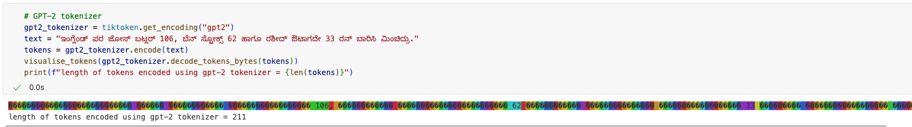
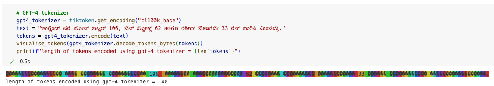
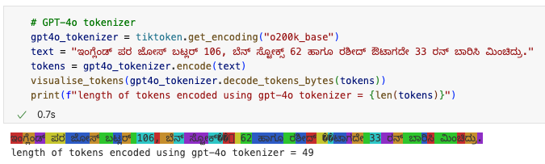
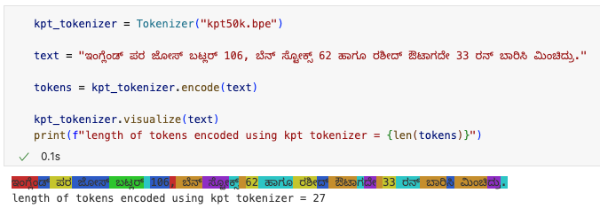

# KPT: Kannada Pretrained Transformer

KPT is an Indic large language model series trained on a dataset with both Kannada and English text.

-   Kannada text from the [sangraha corpus](https://huggingface.co/datasets/ai4bharat/sangraha) and a subset of English text from [Fineweb-Edu](https://huggingface.co/datasets/HuggingFaceFW/fineweb-edu) are used for training
-   A new tokenizer is trained (using BPE) from scratch using a sampled dataset from the above sources.
-   The training dataset consists of ~16 billion tokens generated using a combined corpus of Kannada and English text tokenized using the custom tokenizer.
-   The model is being trained on 4xA100 80 GB GPUs. Checkpoints for both 125M and 760M models are available [here](#model-details)

> NOTE: This is a fun experiment and not an LLM model to be taken seriously.

## Tokenizer Details

### Why a new tokenizer?

-   Most of the Indic languages, including Kannada, have complex scripts with many conjunct characters, and existing tokenizers are not able to handle them well.
-   Most of the tokenizers generate a lengthy token list for Kannada, which is not ideal, and this property forces the models to generate shorter sequences even when models have larger context lengths.
    
    
    

### KPT50k tokenizer

-   The new tokenizer was trained from scratch on a subset of Kannada & English text corpus and has a vocabulary size of 50,257 (same as GPT-2).
-   The tokenizer uses GPT-4o's regex pattern to split tokens efficiently and is trained using the byte pair encoding (BPE) algorithm.
-   The new tokenizer is able to handle conjunct characters and generate shorter token lists for Kannada text.
    
-   The tiktoken version of the tokenizer is available [here](https://pub-43f56be326594cbe8fc3226f999a9886.r2.dev/kpt-125M%2Fkpt50k.bpe).

## Model Details

-   The model architecture is the same as that of GPT-2 and GPT-3 but with Squared ReLU activation in Feed Forward Networks instead of ReLU or GELU.
-   Model implementation is kept simple for easy understanding and debugging.
-   Two versions of the model (KPT-125M and KPT-760M) are being trained on 4xA100 80 GB GPUs.
    -   A checkpoint of KPT-125M trained for 31300 steps (~16B tokens) is available [here](https://pub-43f56be326594cbe8fc3226f999a9886.r2.dev/kpt-125M%2Fmodel_31299.pt).
    -   An early checkpoint of KPT-760M trained for 7400 steps (~3.7B tokens) is available [here](https://pub-43f56be326594cbe8fc3226f999a9886.r2.dev/kpt-750M%2Fmodel_07400.pt).
    -   Better checkpoints for KPT-125M and KPT-760M will be made available as soon as they're ready.
    -   KPT-125M achieves 27.71% accuracy on Hellaswag validation set without any fine-tuning. I've not found a good original (without translation from english) eval dataset for Kannada yet, so I'm using Hellaswag for now.

## Instructions to use the model

The model is not yet fine-tuned on any downstream task or instruct datasets and hence can only be used for completion and embeddings.

-   Download the [checkpoint](https://pub-43f56be326594cbe8fc3226f999a9886.r2.dev/kpt-125M%2Fmodel_31299.pt) and [tokenizer](https://pub-43f56be326594cbe8fc3226f999a9886.r2.dev/kpt-125M%2Fkpt50k.bpe).
-   Install the required libraries using `pip install -r requirements.txt`. There are only two external dependencies :)
-   Run the following code to generate completions:

```python
python inference.py --checkpoint <path_to_model> --tokenizer <path_to_tokenizer_.bpe_file> --input "" --max-length <max-length>
```

-   The model will probably not generate very coherent completions, but just try it out for fun :)
